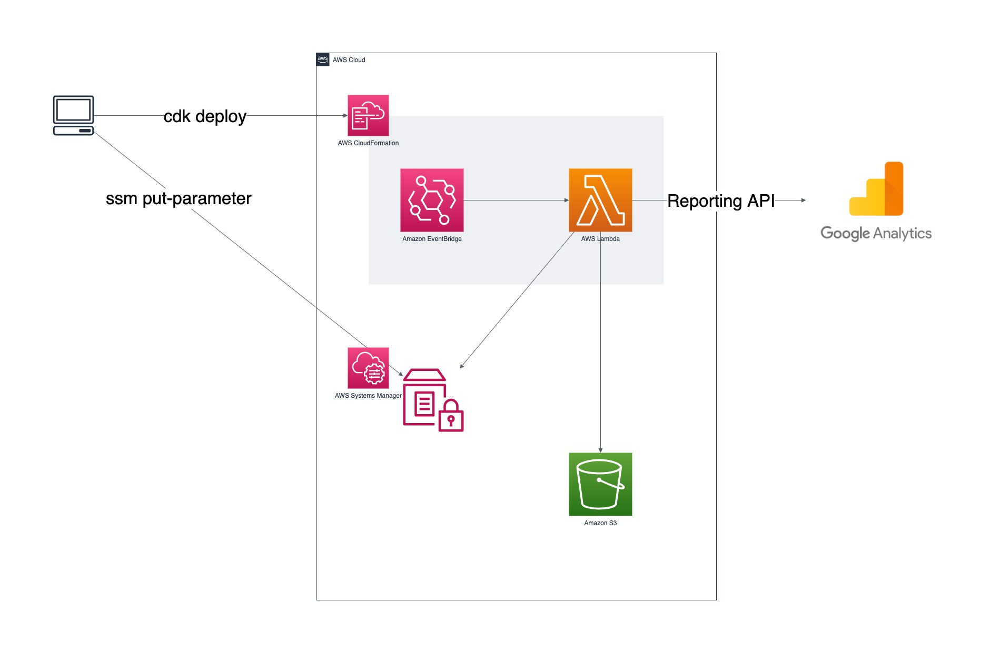

export-pv-rank
---

This is a AWS CDK application that fetch page views from Google Analytics and export ranking data as a JSON file to Amazon S3 bucket.

# Features

- Get report from Google Analytics via Google Analytics Reporting API.
- Generate PV ranking.
- Export it as a JSON object to an Amazon S3 bucket.
- Use Amazon EventBridge scheduling rules to do this on a regular basis.



# Preparing

## Install tools

- AWS CLI

  ```bash
  $ aws --version
  aws-cli/1.22.82 Python/3.9.10 Darwin/21.4.0 botocore/1.24.27
  ```
  
  Or, version 2.x.

  ```bash
  $ aws --version
  aws-cli/2.4.29 Python/3.8.8 Darwin/21.4.0 exe/x86_64 prompt/off
  ```
- jq

  ```bash
  $ jq --version
  jq-1.6
  ```

## Generate Google service account key

Generate Google service account key, and export JSON file to the local machine as the name `client_secrets.json`.

Please see the links below for more information.

- [Creating and managing service account keys | Cloud IAM Documentation](https://cloud.google.com/iam/docs/creating-managing-service-account-keys)

## Setup project

1. Clone this repository

    ```bash
    $ git clone https://github.com/michimani/export-pv-rank.git
    $ cd export-pv-rank
    ```

2. Install npm modules

    ```bash
    $ npm install
    ...
    ```
3. Install Python packages

    ```bash
    $ pip3 install --upgrade -r ./lambda/requirements.txt
    ```

4. Create S3 bucket for CDK

    If this is your first time using the CDK in your AWS account and region, run the following command.
    
    ```bash
    $ cdk bootstrap
    ```

5. Copy client_secrets.json

   Copy the Googel service account key you exported above to the project root directory.
   
   ```bash
   $ cp /path/to/your/key/client_secrets.json ./
   ```

6. Put Google service accoutn key to SSM parameter store

    ```bash
    $ aws ssm put-parameter \
    --name google-client-secret \
    --type SecureString \
    --value "$(jq -c < ./client_secrets.json)"
    ```

7. Create config file

    ```bash
    $  stack-config.json.sample stack-config.json
    ```
    
    - `lambda.env`
      - `client_secret_ssm_key` : SSM parameter store key for Google service account key.
      - `view_id` : ID of Google Analytics view.
      - `out_s3_bucket` : S3 bucket name for export PV ranking JSON file. This bucket must already exist.
      - `out_json_key` : S3 object key for PV ranking JSON.
      - `site_base_url` : Your site base url. (e.g. https://michimani.net)
    - `event_bridge`
      - `cron_expression` : Expression of cron for EventBridge rule.

# Run at local

Output PV ranking JSON to standard output.

```bash
$ sh ./scripts/run_at_local.sh
Running at local...
```
   
# Deloying

1. Create directory for Lambda deploy package

    ```bash
    $ pip3 install --upgrade -r ./lambda/requirements.txt -t ./lambda/dist/ \
    && cp -f ./lambda/src/fetch_rank.py ./lambda/dist/
    ```
2. Generate CloudFormation template

    ```bash
    $ cdk synth
    ```

3. Deploy

    ```bash
    $ cdk deploy
    ```